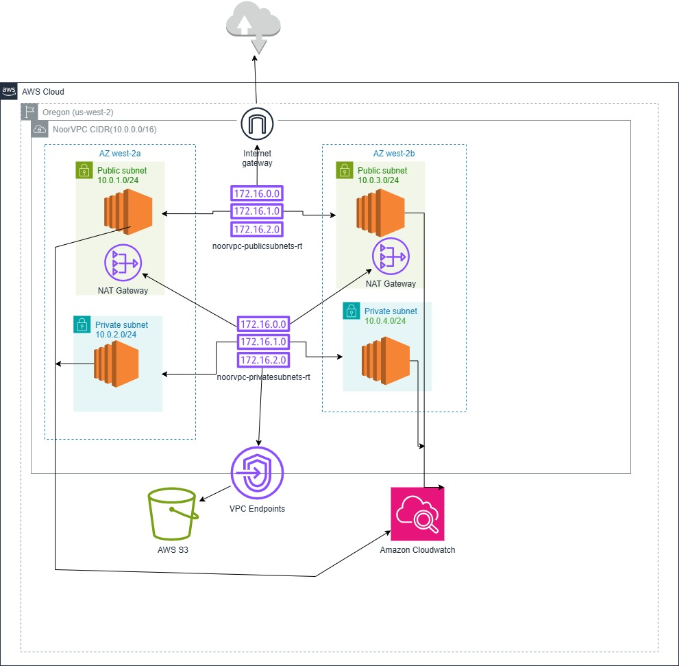

# VPC-Infrastructure
AWS VPC architecture including subnets, route tables, NAT Gateway, Internet Gateway, Security Groups, and Flow Logs configuration
#  AWS VPC Architecture Implementation

This repository documents the design and deployment of a **custom Virtual Private Cloud (VPC)** environment in AWS.  
It demonstrates a production-grade network setup including public/private subnets, NAT Gateway, route tables, VPC endpoints, and traffic control via Security Groups and Network ACLs.

---

## Project Summary
The objective of this task was to design and implement a secure, scalable, and multi-AZ VPC architecture to host EC2 instances in both public and private networks while ensuring controlled Internet access.

---

##  Components Implemented
| No. | Component | Description |
|-----|------------|-------------|
| 1 | **Custom VPC** | Created VPC with CIDR `10.0.0.0/16` |
| 2 | **Subnets** | Two Public and Two Private Subnets across multiple Availability Zones |
| 3 | **Internet Gateway (IGW)** | Provides outbound Internet access for Public Subnets |
| 4 | **Route Tables** | Separate tables for Public and Private subnets with proper associations |
| 5 | **NAT Gateway** | Allows outbound Internet traffic for instances in Private Subnets |
| 6 | **EC2 Instances** | Deployed test instances in both Public and Private subnets |
| 7 | **Security Groups** | Controlled inbound/outbound traffic (SSH, HTTP/HTTPS, ICMP) |
| 8 | **Network ACLs** | Subnet-level access control rules configured |
| 9 | **VPC Flow Logs** | Enabled for traffic monitoring through CloudWatch |
| 10 | **VPC Endpoint (S3)** | Private connectivity to AWS S3 without Internet access |
| 11 | **Elastic IPs** | Attached to NAT Gateway and Public EC2 for persistent public access |
| 12 | **Tagging** | Applied consistent resource tags for cost and management |
| 13 | **Connectivity Testing** | Verified communication between instances and Internet routing |

---

##  Architecture Diagram
Below is the logical representation of the implemented AWS network architecture:

*(Replace `diagram.png` with your actual diagram filename.)*

---

## Full Documentation
Detailed configuration steps, verification outputs, and screenshots are available in the following document:

 [**Task0 – VPC Architecture (PDF)**](Task0%20(VPC%20Architecture).pdf)

---

##  Key Highlights
- Multi-AZ setup ensures **fault tolerance and high availability**.  
- **NAT Gateway + Route Tables** provide controlled Internet access.  
- **Security Groups and NACLs** enforce layered network security.  
- **VPC Flow Logs** enable network visibility and troubleshooting.  
- **S3 VPC Endpoint** allows private AWS service connectivity.  

---

